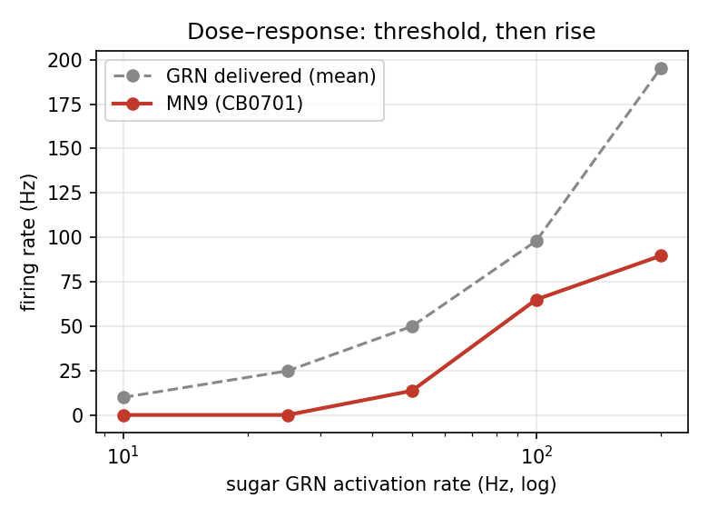
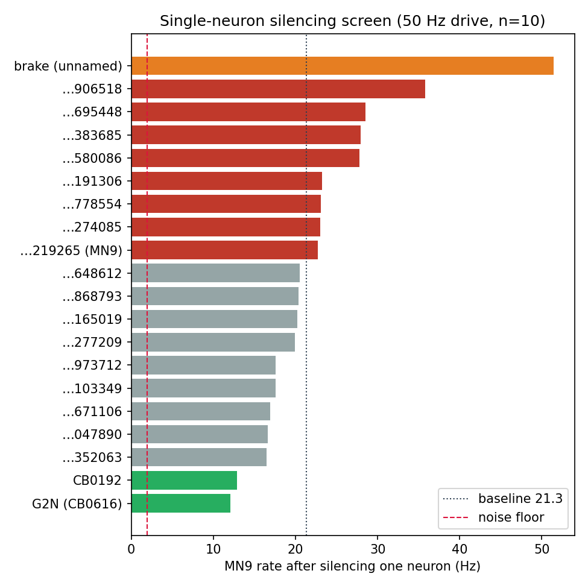
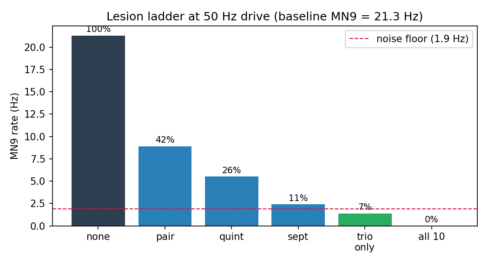
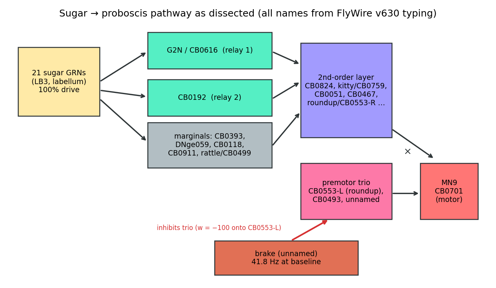

# The sugar circuit, dissected

*Experiments on the Shiu et al. leaky-integrate-and-fire model of the adult
*Drosophila* brain (FlyWire v630 connectome, no tuned parameters). Everything
below was run locally in `results/mine/`; analysis scripts live in
`analysis/`, figures in `analysis/figures/`.*

**Question.** The model was built from the wiring diagram alone. Activate the
sugar-sensing neurons — how does "eat" get from the labellum to the proboscis
motor neuron, and how much of that path can bare wiring explain?

---

## 1. The output neuron and the threshold curve

Tutorial output neuron: **MN9 = `720575940660219265`** (FlyWire typing:
`CB0701`, motor neuron, right side, cholinergic).

Activated the 21 sugar GRNs from the tutorial at 10/25/50/100/200 Hz (5
trials each, 1 s). The delivered GRN rate tracks the commanded rate
(9.9 / 24.8 / 49.9 / 98.0 / 195.2 Hz) — the dose is real. MN9's response is
**not** proportional to it:

| drive (Hz) | 10 | 25 | 50 | 100 | 200 |
|---|---|---|---|---|---|
| MN9 (Hz) | 0.0 | 0.0 | 13.6 | 65.0 | 89.6 |

A threshold element: silent below ~25–50 Hz input, then a steep rise.
The population transform GRNs→MN9 is closer to a switch than a meter.



**The operating-point lesson** (learned the hard way): the first dose-response
run came back *flat* (~66–70 Hz at every drive). Cause: the parameter dict was
mutated before the run (`p[RATE_KEY]` with a junk key left `r_poi` at 150 Hz),
so every "dose" was the same experiment. A flat curve where you expect a slope
is a hypothesis, not an error bar — check what was actually delivered before
believing the shape. Re-running with the real rates produced the threshold
curve above.

## 2. Screening: who matters between GRNs and MN9?

Silenced each of the top-20 most-active non-GRN neurons one at a time
(100 Hz drive, then repeated at 50 Hz, 10 trials, where MN9's baseline is
21.3 Hz and the pathway is mid-range).

At 50 Hz the effect splits cleanly into two camps:

- **The relays** — `…20874757` (−43% MN9) and `…29888530` (−39%).
  Silencing either one alone roughly halves the output.
- **The brake** — `…15041430`. Silencing it makes MN9 fire **2.4× higher**
  (51.4 vs 21.3 Hz). It fires at 41.8 Hz at baseline — the most active
  neuron in the pathway — and its loss *increases* output, so its sign is
  negative: an inhibitory gate, not a relay.

Everything else moves MN9 by less than ±35%, most under 10%.



## 3. Parallel relays, then the tier below them

- **Pair** (silence both relays): MN9 → **8.9 Hz, 42% of baseline**
  (ratio ±0.08 SEM from 10-trial means), with single-relay silencing at 57%
  and 61%. The observed ratio is **consistent with independent parallel
  channels** — the multiplicative prediction 0.57×0.61 = 0.34 lies within
  1 SEM of 0.42 — while the serial prediction (pair ≈ the weaker single ≈
  0.57) and the additive prediction (0.17) are excluded at ~2 and ~3 SEM.
- **Quint** (pair + 3 more from the screen's next tier): MN9 → **5.5 Hz,
  26%.** Which three actually joined? The parquets don't record silenced
  sets (silencing zeroes outgoing synapses; the cells keep spiking, their
  targets go quiet), so membership must be inferred. Reconstruction on each
  candidate's own direct targets — calibrated against the sept run where all
  five marginal-tier neurons were certainly silenced — confirms **CB0393
  (`…32047890`, corr 0.96)** and moderately **CB0118 (`…19973712`, 0.51)**;
  the third member is **not resolvable at this noise level** (the remaining
  candidates' single-lesion effects differ by less than the 1.9 Hz floor, so
  DNge059's +0.43 on exclusive targets is suggestive, not decisive). The
  planning notes for the original run point to the 0.77–0.79 screen tier
  (CB0911, CB0393, DNge059). The circuit conclusion below does not depend on
  which of the weak-tier three it was: silencing *all five* (sept, 11% vs
  quint's 26%) brackets the whole tier's contribution at ~15 points.

## 4. The leftover 26% — tracing it turned the circuit inside out

Where does the remaining 26% flow after the quint? Answering that with the
connectivity matrix overturned my mental picture:

**The relays have no direct synapses onto MN9.** Zero. MN9's direct input is
dominated by a **premotor trio** — `…19853515` (w=561), `…23211725` (w=424),
`…32252743` (w=281) — whose firing collapses whenever relays or marginals are
silenced. The relays work through a **second-order layer**
(`…24023188` w=290, `…44669732` w=222, `…32365905` w=174, …) that feeds the
trio. And the brake's inhibition lands overwhelmingly on trio member
`…23211725` (w=−100), with only a token direct contact onto MN9 itself
(one synapse, w=−1): **feed-forward inhibition onto the final common path**,
which is why removing the brake amplifies everything downstream.

So the motif is not "GRNs → relays → MN9" but:

```
21 GRNs (LB3)  →  relays + marginals  →  2nd-order layer  →  premotor trio  →  MN9
                                        ↑
                        brake (unannotated, 41.8 Hz) ── inhibits trio
```

Closing experiments (50 Hz, 10 trials; noise floor = 1.9 Hz, measured as the
MN9 difference between two identical baseline runs):

| lesion | MN9 (Hz) | % of baseline |
|---|---|---|
| none (baseline) | 21.3 | 100% |
| both relays (pair) | 8.9 | 42% |
| pair + 3 marginal-tier (quint) | 5.5 | 26% |
| relays + all 5 marginal-tier (sept) | 2.4 | 11% |
| **premotor trio alone** | **1.4** | **7%** |
| relays + 5 marginals + trio (dec) | **0.0** | **0%** |



Two clean endings: **the premotor trio is the final common path** — silencing
just those three does more than silencing seven upstream neurons — and the
arc closes at exactly **0.0 Hz** with all ten in hand. The leftover 26% was
never a mystery parallel path; it was the un-lesioned middle layer feeding the
same trio.



## 5. The names check

Against the paper's own SEZ cell-type table (`sez_neurons.pickle`, 106 named
types) and the full FlyWire annotation dump (Schlegel et al.,
`flywire_annotations` Supplemental File 1, v630 root IDs — same
materialization as the model):

| role | FlyWire ID | cell type | name in paper's SEZ table |
|---|---|---|---|
| output | …60219265 | **CB0701** (motor, Ach) | — |
| relay 1 | …20874757 | **CB0616** (Ach) | **G2N_1** (one of its 2 members) |
| relay 2 | …29888530 | **CB0192** (Ach) | — |
| brake | …15041430 | **unannotated in v630** | — |
| marginal tier | …23352063 | CB0911 (motor) | — |
| marginal tier | …32047890 | CB0393 | — |
| marginal tier | …15671106 | DNge059 (descending!) | — |
| marginal tier | …19973712 | CB0118 (**GABA**) | — |
| marginal tier | …38103349 | CB0499 | rattle |
| premotor | …23211725 | CB0553 | roundup |
| premotor | …32252743 | CB0493 | — |
| premotor | …19853515 | **unannotated in v630** | — |
| 2nd-order | …24023188 | CB0824 | — |
| 2nd-order | …44669732 | CB0759 | kitty |
| MN9's top inhibitor | …36809646 | CB0465 (**GABA**) | — |

Full table: `analysis/names.csv`. The 21 driven "sugar GRNs" are **20× LB3**
(labellar gustatory) + 1 unannotated (`…20900446`) — the drive set is
essentially one named GRN class.

Verdict: **a blind rediscovery** — one of my two relays is G2N, a named SEZ
interneuron. The brake and one premotor-trio member are **unannotated in the
v630 release used here**; typing has continued since (v783 and later
releases), so that is a statement about the annotation snapshot, not a
novelty claim — checking them against current literature would be its own
project.

## 6. What the wiring alone bought, and what it can't

Explained by pure anatomy, zero tuning: a threshold dose-response curve,
independent parallel relays feeding a distributed second-order layer,
a feed-forward inhibitory brake onto the premotor bottleneck, and a fully
floored output under combined lesion. The connectome is the circuit — the
pipeline from GRNs to proboscis is in the wiring.

Out of reach by construction: learning, satiety, neuromodulation, any state —
the model has no plasticity, no modulators, and one static operating point.
No amount of tinkering changes that; it's the price of the no-free-parameters
design.

## 7. Verification

The load-bearing numbers were re-derived adversarially from the raw files
(`analysis/verify_claims.py`, independent of the scripts that produced the
results): (1) relay→MN9 synapse rows — zero, confirmed on raw connectivity
rows; (2) trio weights onto MN9 — 561/424/281, confirmed; (3) brake wiring —
383 outgoing synapses, net w=−3070, w=−100 onto CB0553-L and w=−1 onto MN9;
(4) relay1 ∈ pickle's `G2N_1` list, confirmed by eyeball; (5) every lesion
table row recomputed from raw spike parquets, all match; (6) pair/single
ratios confirm the parallel claim (pair 0.42 < both singles); (7) the one
non-LB3 GRN identified by ID.

## Reproduce

```bash
conda activate brian2
python analysis/run_leftover.py      # trio / sept / dec sims (~1 h serial)
python analysis/reconstruct.py       # dose-response + screens + inference
python analysis/trace_leftover.py    # connectivity trace (trio, brake, MN9 inputs)
python analysis/make_figures.py      # figures + names.csv
python analysis/verify_claims.py     # adversarial re-check of every headline
```

Environment: Brian 2 + C++ compilation, FlyWire v630 materialization,
`r_poi` = commanded drive, `n_run` = 5 (dose) / 10 (screen + lesions),
`t_run` = 1 s. Seed noise measured at 1.9 Hz on MN9 (10-trial means).
